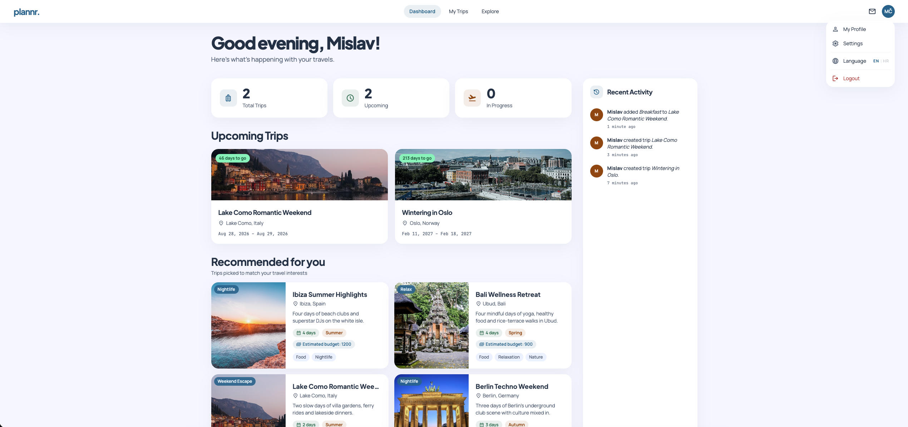
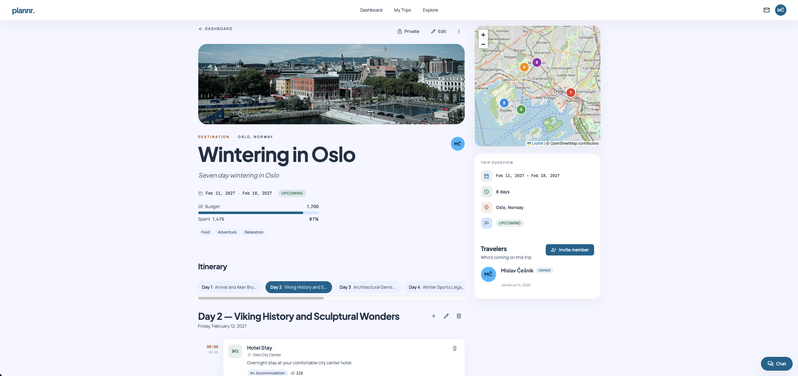
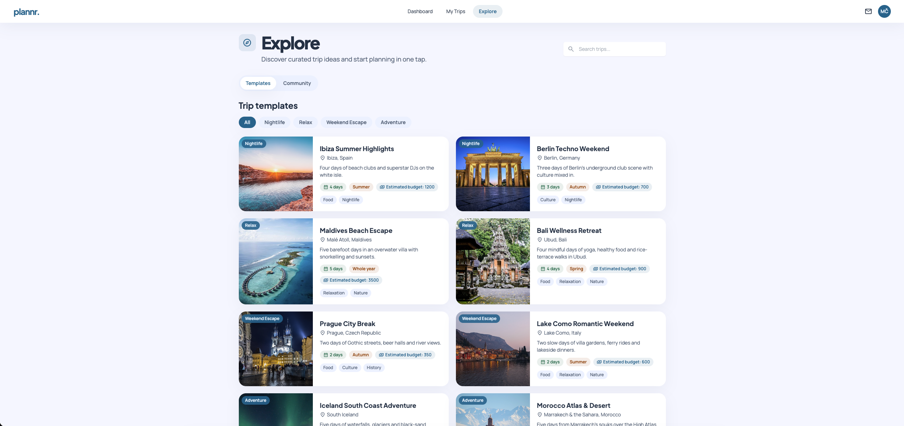
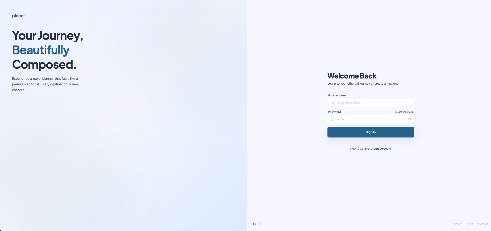

# Planner — Frontend

Angular frontend for **Planner**, a collaborative travel planning application built as part of a master's thesis (diplomski rad). Users can plan trips with day-by-day itineraries, browse and apply trip templates, invite other members, chat in real time, and generate itineraries with AI.

This repository contains only the client application. The REST/WebSocket API lives in the companion [`planner-backend`](https://github.com/mizolf/planner-backend) repository (Java Spring Boot), expected to run at `http://localhost:8080`.

## Screenshots

| Dashboard | Trip details |
| --- | --- |
|  |  |

| Explore | Login |
| --- | --- |
|  |  |

## Tech stack

- [Angular 18](https://angular.dev/) (standalone components), TypeScript 5.5, RxJS 7.8
- [Tailwind CSS 3.4](https://tailwindcss.com/) + SCSS for component styles
- [ngx-translate 17](https://github.com/ngx-translate/core) — i18n (English and Croatian)
- [Leaflet 1.9](https://leafletjs.com/) — maps, with [Photon](https://photon.komoot.io/) geocoding for location autocomplete
- [@stomp/stompjs 7](https://stomp-js.github.io/) — real-time trip chat over WebSocket
- Karma + Jasmine — unit tests

## Prerequisites

- Node.js 20 (Angular 18 requires ≥ 18.19) and npm
- A running [`planner-backend`](https://github.com/mizolf/planner-backend) instance on port 8080 for full functionality

## Getting started

```bash
npm install
npm start
```

The app is served at `http://localhost:4200` and reloads on source changes.

Other scripts:

```bash
npm run build   # production build → dist/planner-frontend
npm run watch   # development build, rebuilds on source changes
npm test        # unit tests (Karma + Jasmine)
```

## Configuration

Environment settings live in `src/environments/`:

| File | Used for | `apiUrl` | `wsUrl` |
| --- | --- | --- | --- |
| `environment.ts` | development | `http://localhost:8080` | `ws://localhost:8080/ws` |
| `environment.prod.ts` | production build | production API URL | production WebSocket URL |

The frontend holds no secrets — all credentials and API keys are configured on the backend.

## Docker

The `Dockerfile` is a multi-stage build: the app is compiled with Node 20 and served by nginx on port 80.

`docker-compose.yml` starts the full stack — the backend (`app`, port 8080) and this frontend (`web`, available at `http://localhost:4200`):

```bash
docker compose up --build
```

Note: compose builds the backend from the sibling `../planner-backend` directory and loads its environment from `../planner-backend/.env`, so that repository must be checked out next to this one with a configured `.env` file (never commit it).

Compose builds the frontend with the `development` configuration (`BUILD_CONFIG: development`), so the containerized app uses `environment.ts` and talks to the backend at `http://localhost:8080` — which is exactly what the `app` service exposes. The `production` configuration (and its API URL) is only used for a real deployment build.

---

Developed by **Mislav Češnik** as part of a master's thesis (diplomski rad).
